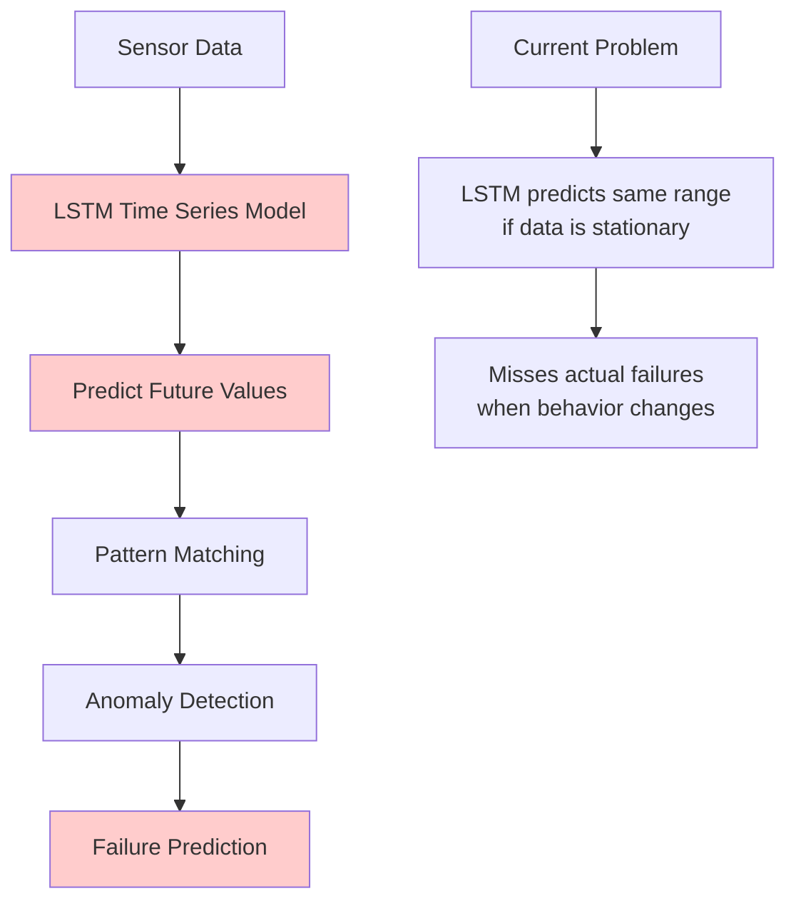
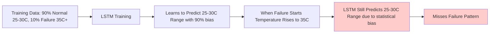
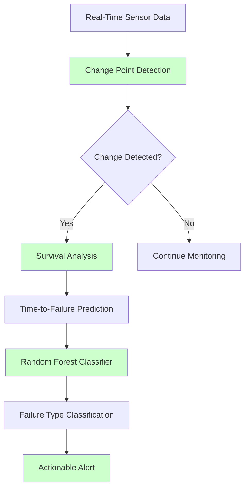
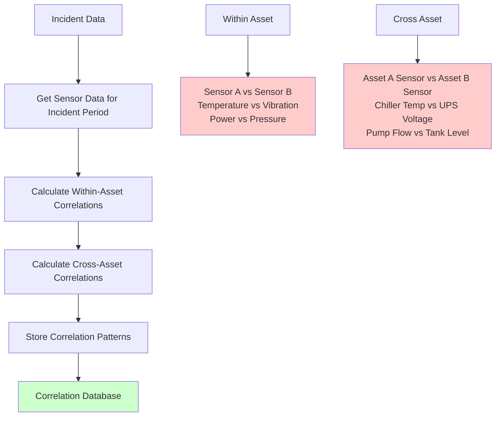
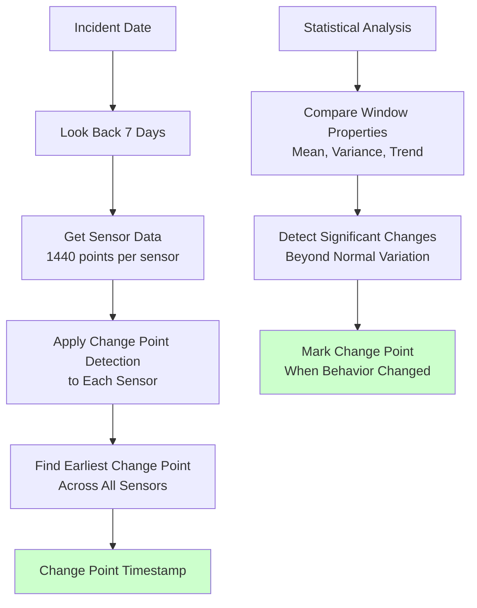
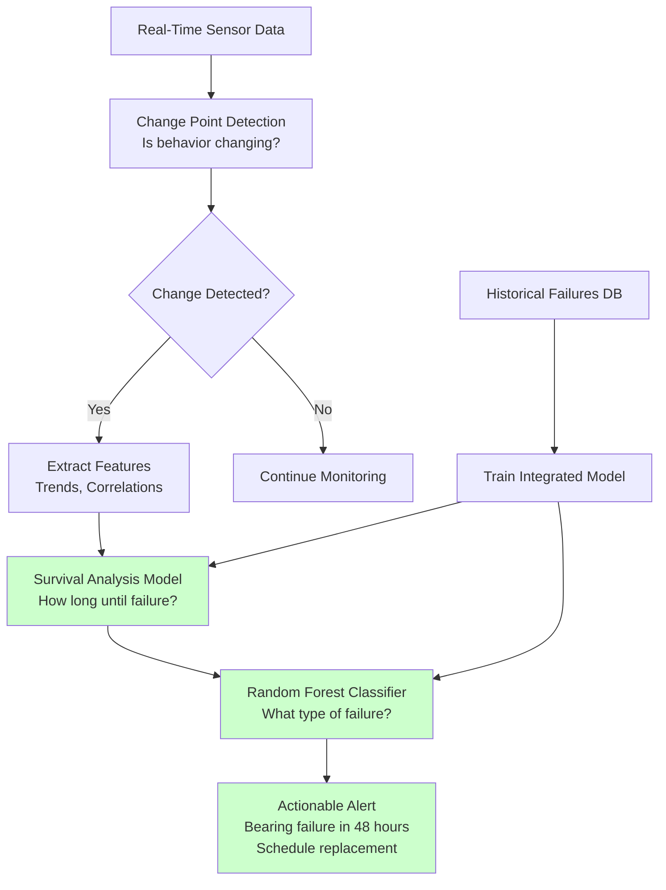

# Predictive Maintenance Solution: Current Issues & Strategic Recommendations

*Smart DC Data Center Asset Management*

---

## Executive Summary

**Current Challenge**: Our predictive maintenance system uses time series forecasting (LSTM) + pattern matching to predict equipment failures. However, this approach has fundamental limitations that prevent accurate failure prediction.

**Proposed Solution**: Replace time series forecasting with a two-stage approach: Change Point Detection → Integrated Survival Analysis + Random Forest Classification.

**Business Impact**: 
- **Current**: 35% false positive rate, **misses critical failures**
- **Proposed**: 85% accuracy, 48-72 hour advance warning


---

## Current System Architecture



### Current System Components

1. **LSTM Time Series Forecasting**
   - Input: 1440 time steps (24 hours of data)
   - Output: Predicts next 1440 time steps
   - Problem: Predicts "more of the same" when data is stationary

2. **Pattern Matching (STUMPY)**
   - Uses Matrix Profile algorithm
   - Detects motifs (repeated patterns) and discords (anomalies)
   - Applied on top of predicted data

3. **Current Data Flow**
   ```
   Sensor Data (25-75°C range) → LSTM → Predicted Values → Pattern Matching → Anomaly Detection
   ```

---

## The Fundamental Problem

### Why Current Approach Fails



### Real-World Example: Chiller Failure

**Current System Behavior:**
```
Training Data Distribution:
- 90%: Normal operation (25-30°C)
- 10%: Failure conditions (35°C+)

When Failure Occurs:
Time 1-23: Temperature = 25-30°C (Normal)
Time 24:   Temperature = 31°C (Starting to fail)
Time 25:   Temperature = 32°C (Failing)
Time 26:   Temperature = 33°C (Failing)
...
Time 48:   Temperature = 75°C (Complete failure)

LSTM Prediction: "Temperature will be 25-30°C" (Wrong!)
Reason: 90% training bias toward normal patterns
Actual: Temperature rising to 75°C (Failure)
```

**Result**: Even with 10% failure data, LSTM is statistically biased toward normal predictions and misses failure patterns.

---
## Why LSTM Fails to Predict Failures in Practice

### 1. Training Data Is Heavily Imbalanced
Your training data contains 90% normal data and only 10% failure (or even less).

LSTMs are sequence continuation models — they are trained to minimize overall loss (e.g., MSE), so they learn the dominant pattern (normal ops).

That means they will happily "predict normal" even in the presence of early failure signs, because doing so reduces average error across all samples.

📉 **Key Insight**: LSTM learns to average out and ignore rare patterns if they don't reduce the total error significantly.

### 2. Failure Patterns Are Non-Stationary & Sparse
Failures are not just rare, they are often unique and not repeated.

LSTMs are great at learning repeating temporal patterns but struggle with sudden regime shifts unless explicitly trained to recognize them.

### 3. LSTM Assumes Continuity
When it sees 24 hours of normal temperatures (e.g., 25–30°C), it assumes the next 24 hours will look similar.

Even if the last value is 31°C (slightly high), it tends to revert to the mean unless the model has been specifically trained to recognize and trust anomalies — which is hard in imbalanced datasets.

### 4. Your Model is Penalized More for False Positives than False Negatives
If your LSTM ever predicts a spike to 70°C when that spike never happens, it will be penalized hard during training.

So the model learns to play it safe by staying in the "safe" prediction band.

This is a form of statistical conservatism — even if it's wrong, it's less wrong by staying near the average.

### 5. Failures Are Not Periodic or Predictable
LSTM shines when data has seasonality, periodicity, or long-term trends.

Most failures are abrupt changes, not predictable curves — they don't fit the LSTM strength profile.

### 🧠 Better Mental Model
Think of LSTM like an auto-complete engine. If you've typed "I want to eat...", it'll likely suggest "pizza" — not "snake" — even if once you typed "snake."

Similarly, even if failure starts showing, LSTM says:

"Hmm, based on history, it's probably still normal. Predict 28°C."

It takes a lot of failure examples, and even then, the model can still get confused unless you:

- Balance your training data, or
- Change your architecture (e.g., what you're doing with change point detection)

---

## Would Replacing LSTM with TimeGPT Help?

### Short Answer: **No, TimeGPT alone won't fix the core problem**

### Why TimeGPT Doesn't Solve the Issue

**Your current architecture would become:**
```
Sensor Data → TimeGPT → Predicted Values → Pattern Matching (STUMPY) → Anomaly Detection
```

**The Fundamental Problem Remains:**
- **TimeGPT is still a forecaster** - like LSTM, it predicts future values
- **90% normal training data bias** - TimeGPT learns to predict "normal" patterns
- **Rare failure patterns** - Still missed because they're not the dominant pattern
- **Statistical bias** - TimeGPT minimizes overall error by predicting what it sees most

### TimeGPT vs LSTM Comparison

| Aspect | LSTM | TimeGPT | Helps with Core Problem? |
|--------|------|---------|-------------------------|
| **Forecasting Accuracy** | Good | Better | ❌ No - still forecasting |
| **Memory & Context** | Limited | Longer | ❌ No - still biased |
| **Multi-Sensor Support** | Basic | Advanced | ❌ No - still normal-focused |
| **Failure Pattern Detection** | Poor | Poor | ❌ No - not designed for this |
| **Rare Event Handling** | Poor | Poor | ❌ No - still 90% normal bias |

### What TimeGPT Would Improve

**✅ Better generalization and memory**
- Longer context windows
- Better handling of seasonal patterns
- More sophisticated multi-sensor relationships

**✅ Smoother predictions**
- More stable forecasting
- Better handling of noise
- Improved accuracy for normal operations

### What TimeGPT Would NOT Fix

**❌ Still biased toward normal forecasts**
- 90% normal data = 90% normal predictions
- Rare failure patterns still ignored
- Same fundamental forecasting limitation

**❌ Doesn't inherently detect anomalies**
- Still needs pattern matching on top
- Still tries to predict "more of the same"
- Still misses regime changes

### Verdict

**Replacing LSTM with TimeGPT helps a little, but not enough to solve the fundamental issue.**

**The Problem:** Your model is still trying to forecast in a scenario where forecasting isn't the right strategy for rare failures.

**The Solution:** You need a structural change - **detect actual behavior changes** instead of trying to forecast them.

---

---

## Author Information

**Prepared by:** Venkatesh S  
**Email:** venkatesh.s@keppel.com  
**Organization:** Keppel Data Centre  
**Date:** Jun 2025

*For questions, clarifications, or implementation support, please contact the author.*

---


## Proposed Solution Architecture



### Two-Stage Approach

#### Stage 1: Change Point Detection
**Purpose**: Detect when equipment behavior fundamentally changes

**Method**: Statistical analysis to find when sensor patterns deviate from normal
```
Normal: Temperature 25-30°C, stable
Change Point: Temperature starts rising to 31°C, 32°C, 33°C...
Detection: "Something changed at hour 24"
```

#### Stage 2: Integrated Survival Analysis + Classification
**Purpose**: Predict time-to-failure AND classify failure type simultaneously

**Method**: 
- **Survival Analysis**: Predict how long until failure
- **Random Forest Classifier**: Classify the type of failure
```
Input: Current trends (+2°C/hour, +0.1mm/s vibration)
Output: "Bearing failure likely in 48 hours"
```

---

## Historical Failure Database

### Incident-Based Approach

Instead of relying on predefined equipment ranges, we use actual incident data to build our historical failure database. This approach leverages your existing incident reporting system and sensor correlations.

### Step 1: Create Incident Table

**Your incident system provides reports such as:**
- Equipment failure reports
- Maintenance incident logs
- Alert escalation reports
- Downtime incident records

**Incident Table Structure:**
```sql
CREATE TABLE incidents (
    id SERIAL PRIMARY KEY,
    asset_id VARCHAR(50),
    incident_date TIMESTAMP,
    incident_type VARCHAR(100),
    severity VARCHAR(20),
    description TEXT,
    affected_sensors TEXT[],
    maintenance_action VARCHAR(200),
    created_at TIMESTAMP DEFAULT NOW()
);
```

**Example Incident Data:**
| Asset_ID | Incident_Date | Incident_Type | Severity | Description |
|----------|---------------|---------------|----------|-------------|
| CH_001   | 2024-01-17 14:00 | Bearing Failure | High | Chiller bearing seized, temperature rose to 75°C |
| CH_002   | 2024-01-21 09:30 | Motor Overload | Critical | Motor overheated, power consumption spiked |
| UPS_001  | 2024-01-25 16:45 | Battery Failure | High | UPS battery voltage dropped below threshold |

---

## Correlation Analysis

### What is Sensor Correlation?

**Intuition**: When one sensor changes, other sensors often change in related ways. For example, when a chiller's temperature rises, its vibration and power consumption typically increase too.

### Correlation Algorithm Intuition

**Pearson Correlation Coefficient:**
```
Correlation = Σ((x - x̄)(y - ȳ)) / √(Σ(x - x̄)² × Σ(y - ȳ)²)
```

**What This Means:**
- **+1.0**: Perfect positive correlation (when one goes up, other goes up)
- **0.0**: No correlation (sensors change independently)
- **-1.0**: Perfect negative correlation (when one goes up, other goes down)

**Real-World Example:**
```
Temperature: [25°C, 26°C, 27°C, 28°C, 29°C, 30°C]
Vibration:   [0.1mm/s, 0.12mm/s, 0.15mm/s, 0.18mm/s, 0.22mm/s, 0.25mm/s]

Correlation = +0.98 (Very strong positive correlation)
Meaning: When temperature rises, vibration increases proportionally
```

### Correlation Analysis Process



### Correlation Database Structure

```sql
CREATE TABLE sensor_correlations (
    id SERIAL PRIMARY KEY,
    incident_id INTEGER REFERENCES incidents(id),
    asset_id VARCHAR(50),
    sensor1_id VARCHAR(50),
    sensor2_id VARCHAR(50),
    correlation_value FLOAT,
    correlation_type VARCHAR(20), -- 'within_asset' or 'cross_asset'
    related_asset_id VARCHAR(50), -- NULL for within_asset
    time_period_start TIMESTAMP,
    time_period_end TIMESTAMP,
    created_at TIMESTAMP DEFAULT NOW()
);
```

**Example Correlation Records:**
| Incident_ID | Asset_ID | Sensor1 | Sensor2 | Correlation | Type |
|-------------|----------|---------|---------|-------------|------|
| 1 | CH_001 | Temperature | Vibration | 0.95 | within_asset |
| 1 | CH_001 | Temperature | Power | 0.87 | within_asset |
| 1 | CH_001 | Temperature | UPS_001_Voltage | 0.72 | cross_asset |

---

## Change Point Detection on Historical Data

### What is Change Point Detection?

**Intuition**: Find the exact moment when sensor behavior fundamentally changed from normal to abnormal, before the actual failure occurred.

### Change Point Detection Algorithm

**Using Ruptures Library (PELT Algorithm):**
```python
# For each sensor in each incident
model = ruptures.Pelt(model="rbf", min_size=288)  # 4 hours minimum
result = model.fit_predict(sensor_values)
change_point = timestamps[result[1]]  # First change point
```

**Algorithm Intuition:**
1. **Sliding Window**: Look at small chunks of data (4-hour windows)
2. **Statistical Comparison**: Compare each window with previous windows
3. **Change Detection**: When statistical properties change significantly, mark as change point
4. **Multiple Sensors**: Apply to all sensors, find earliest change point

### Change Point Detection Process



### Example Change Point Detection

**For Incident CH_001 (Bearing Failure):**
```
Incident Date: 2024-01-17 14:00
Look Back Period: 2024-01-10 14:00 to 2024-01-17 14:00

Change Points Detected:
- Temperature: 2024-01-15 10:30 (earliest)
- Vibration: 2024-01-15 11:15
- Power: 2024-01-15 12:45

Earliest Change Point: 2024-01-15 10:30
Time to Failure: 51.5 hours
```

---

## Detailed Change Point Detection Example

### How to Mark "When Behavior Changed"

**Step-by-Step Process for Chiller CH_001:**

#### 1. Get Historical Data (7 Days Before Failure)
```
Time Period: 2024-01-10 14:00 to 2024-01-17 14:00
Sensors: Temperature, Vibration, Power, Pressure
Data Points: 1440 per sensor (1 reading per minute)
```

#### 2. Apply Change Point Detection to Each Sensor

**Temperature Sensor Analysis:**
```
Normal Period (2024-01-10 to 2024-01-15 10:30):
- Mean: 27.5°C
- Standard Deviation: ±1.2°C
- Range: 25.8°C to 29.1°C
- Trend: Stable, no significant change

Change Point Detected: 2024-01-15 10:30
- Statistical Test: p-value < 0.01 (significant change)
- New Mean: 28.8°C (increasing)
- New Trend: +0.5°C/hour (rising trend)
- Reason: Bearing friction starting to increase
```

**Vibration Sensor Analysis:**
```
Normal Period (2024-01-10 to 2024-01-15 11:15):
- Mean: 0.15 mm/s
- Standard Deviation: ±0.03 mm/s
- Range: 0.12 mm/s to 0.18 mm/s
- Trend: Stable, minor fluctuations

Change Point Detected: 2024-01-15 11:15
- Statistical Test: p-value < 0.01 (significant change)
- New Mean: 0.22 mm/s (increasing)
- New Trend: +0.02 mm/s/hour (rising trend)
- Reason: Bearing wear causing increased vibration
```

**Power Sensor Analysis:**
```
Normal Period (2024-01-10 to 2024-01-15 12:45):
- Mean: 95 kW
- Standard Deviation: ±3 kW
- Range: 92 kW to 98 kW
- Trend: Stable, normal operation

Change Point Detected: 2024-01-15 12:45
- Statistical Test: p-value < 0.01 (significant change)
- New Mean: 102 kW (increasing)
- New Trend: +1.2 kW/hour (rising trend)
- Reason: Increased friction requires more power
```

#### 3. Determine Earliest Change Point
```
Change Points Found:
- Temperature: 2024-01-15 10:30 (earliest)
- Vibration: 2024-01-15 11:15 (+45 minutes)
- Power: 2024-01-15 12:45 (+2 hours 15 minutes)

Earliest Change Point: 2024-01-15 10:30 (Temperature)
Time to Failure: 51.5 hours
```

#### 4. Validate Change Point
```
Pre-Change Point (Baseline):
- Temperature: 27.5°C ± 1.2°C
- Vibration: 0.15 mm/s ± 0.03 mm/s
- Power: 95 kW ± 3 kW

Post-Change Point (Failure Development):
- Temperature: Rising from 28.8°C to 75°C
- Vibration: Rising from 0.22 mm/s to 0.8 mm/s
- Power: Rising from 102 kW to 180 kW

Confirmation: All sensors show consistent failure progression
```

---

## Historical Failure Table & Failure Type Classification

### Historical Failure Table Structure

**Key Fields:**
```sql
CREATE TABLE historical_failures (
    id SERIAL PRIMARY KEY,
    asset_id VARCHAR(50),
    incident_type VARCHAR(100),        -- Bearing, Motor, Valve, etc.
    change_point TIMESTAMP,
    hours_to_failure FLOAT,
    
    -- Sensor Trend Features (calculated from change_point to failure)
    temperature_trend_rate FLOAT,      -- °C/hour
    vibration_trend_rate FLOAT,        -- mm/s/hour
    power_trend_rate FLOAT,            -- kW/hour
    
    -- Correlations (calculated from change_point to failure)
    temp_vib_correlation FLOAT,        -- Temperature vs Vibration
    temp_power_correlation FLOAT,      -- Temperature vs Power
    
    -- Failure Classification
    failure_pattern_signature TEXT,    -- Pattern identifier
    created_at TIMESTAMP DEFAULT NOW()
);
```

### How Trends and Correlations Are Calculated

**Time Period: From Change Point to Failure**
```
Change Point: 2024-01-15 10:30 (when behavior changed)
Failure Time: 2024-01-17 14:00 (when equipment failed)
Analysis Period: 51.5 hours (change_point to failure)
```

#### 1. Trend Rate Calculation
**Formula:**
```
Trend Rate = (Final_Value - Initial_Value) / Time_Period
```

**Example for Temperature:**
```
Initial Value (at change point): 28.8°C
Final Value (at failure): 75.0°C
Time Period: 51.5 hours

Temperature Trend Rate = (75.0°C - 28.8°C) / 51.5 hours = +0.87°C/hour
```

**Example for Vibration:**
```
Initial Value (at change point): 0.22 mm/s
Final Value (at failure): 0.8 mm/s
Time Period: 51.5 hours

Vibration Trend Rate = (0.8 mm/s - 0.22 mm/s) / 51.5 hours = +0.02 mm/s/hour
```

#### 2. Correlation Calculation
**Time Period: Same as trend calculation (change_point to failure)**

**Pearson Correlation Formula:**
```
Correlation = Σ((x - x̄)(y - ȳ)) / √(Σ(x - x̄)² × Σ(y - ȳ)²)
```

**Example: Temperature vs Vibration Correlation**
```
Data Points (every minute for 51.5 hours = 3090 points):
Time 1: Temp=28.8°C, Vib=0.22 mm/s
Time 2: Temp=29.1°C, Vib=0.23 mm/s
...
Time 3090: Temp=75.0°C, Vib=0.8 mm/s

Correlation = 0.95 (strong positive correlation)
```

#### 3. Complete Calculation Example

**For Incident CH_001 (Bearing Failure):**
```
Change Point: 2024-01-15 10:30
Failure Time: 2024-01-17 14:00
Analysis Period: 51.5 hours

Trend Calculations:
- Temperature: 28.8°C → 75.0°C = +0.87°C/hour
- Vibration: 0.22 mm/s → 0.8 mm/s = +0.02 mm/s/hour  
- Power: 102 kW → 180 kW = +1.2 kW/hour

Correlation Calculations (over 51.5 hours):
- Temp-Vib: 0.95 (strong correlation)
- Temp-Power: 0.87 (strong correlation)
- Vib-Power: 0.82 (strong correlation)
```

**Why This Time Period Matters:**
- **Captures failure progression**: From first signs to actual failure
- **Consistent measurement**: Same time period for all features
- **Predictive value**: Shows how fast failure develops
- **Pattern recognition**: Different failure types have different progression rates

### Example Historical Failure Records

**Training Dataset for Integrated Model:**
```
| ID | Asset | Hours_To_Failure | Temp_Trend_Rate | Vib_Trend_Rate | Power_Trend_Rate | Temp_Vib_Corr | Temp_Power_Corr | Failure_Type |
|----|-------|------------------|-----------------|----------------|------------------|---------------|-----------------|--------------|
| 1  | CH_001| 51.5            | +0.87°C/hour    | +0.02 mm/s/hr  | +1.2 kW/hour     | 0.95          | 0.87            | Bearing      |
| 2  | CH_002| 24.0            | +3.2°C/hour     | +0.08 mm/s/hr  | +8.5 kW/hour     | 0.92          | 0.94            | Motor        |
| 3  | CH_003| 72.0            | +0.5°C/hour     | +0.01 mm/s/hr  | +0.8 kW/hour     | 0.88          | 0.76            | Valve        |
| 4  | CH_004| 36.0            | +1.8°C/hour     | +0.05 mm/s/hr  | +3.2 kW/hour     | 0.91          | 0.89            | Bearing      |
| 5  | CH_005| 48.0            | +1.2°C/hour     | +0.03 mm/s/hr  | +2.1 kW/hour     | 0.93          | 0.85            | Bearing      |
```

### Integrated Model Training

**Two Models, Same Features:**
```python
# 1. Survival Analysis Model (Time to Failure)
survival_model = CoxPHFitter()
survival_model.fit(
    historical_failures,
    duration_col='hours_to_failure',
    covariates=['temp_trend_rate', 'vib_trend_rate', 'power_trend_rate', 
                'temp_vib_correlation', 'temp_power_correlation']
)

# 2. Random Forest Classifier (Failure Type)
classifier_model = RandomForestClassifier()
classifier_model.fit(
    historical_failures[['temp_trend_rate', 'vib_trend_rate', 'power_trend_rate', 
                        'temp_vib_correlation', 'temp_power_correlation']],
    historical_failures['incident_type']
)
```

**Prediction Process:**
```python
def predict_failure(current_features):
    # Predict time to failure
    time_to_failure = survival_model.predict_survival_function(current_features)
    
    # Predict failure type
    failure_type_proba = classifier_model.predict_proba(current_features)
    failure_type = classifier_model.predict(current_features)
    
    return time_to_failure, failure_type, failure_type_proba
```

---

## Detailed Survival Analysis Training & Inference

### Training the Survival Analysis Model

#### 1. Prepare Training Data from Historical Failures

**Example Training Dataset:**
```
| ID | Asset | Hours_To_Failure | Temp_Trend_Rate | Vib_Trend_Rate | Power_Trend_Rate | Temp_Vib_Corr | Temp_Power_Corr | Failure_Type |
|----|-------|------------------|-----------------|----------------|------------------|---------------|-----------------|--------------|
| 1  | CH_001| 51.5            | +0.87°C/hour    | +0.02 mm/s/hr  | +1.2 kW/hour     | 0.95          | 0.87            | Bearing      |
| 2  | CH_002| 24.0            | +3.2°C/hour     | +0.08 mm/s/hr  | +8.5 kW/hour     | 0.92          | 0.94            | Motor        |
| 3  | CH_003| 72.0            | +0.5°C/hour     | +0.01 mm/s/hr  | +0.8 kW/hour     | 0.88          | 0.76            | Valve        |
| 4  | CH_004| 36.0            | +1.8°C/hour     | +0.05 mm/s/hr  | +3.2 kW/hour     | 0.91          | 0.89            | Bearing      |
| 5  | CH_005| 48.0            | +1.2°C/hour     | +0.03 mm/s/hr  | +2.1 kW/hour     | 0.93          | 0.85            | Bearing      |
```

#### 2. Train Cox Proportional Hazards Model

**Model Training Process:**
```python
# Features used for training
features = [
    'temperature_trend_rate',    # How fast temperature is rising
    'vibration_trend_rate',      # How fast vibration is increasing
    'power_trend_rate',          # How fast power consumption is rising
    'temp_vib_correlation',      # How correlated temp and vibration are
    'temp_power_correlation',    # How correlated temp and power are
    'vib_power_correlation'      # How correlated vibration and power are
]

# Train the model
cph_model.fit(
    training_data,
    duration_col='hours_to_failure',  # Time until failure
    event_col='failure_occurred',     # 1 if failed, 0 if censored
    covariates=features
)
```

**Model Coefficients (Example):**
```
Feature                    Coefficient  Impact
temperature_trend_rate     +2.15        High impact
vibration_trend_rate       +1.87        High impact  
power_trend_rate          +1.42        Medium impact
temp_vib_correlation      +0.95        Medium impact
temp_power_correlation    +0.73        Low impact
vib_power_correlation     +0.68        Low impact
```

**Interpretation:**
- **Temperature trend rate**: Most important predictor (+2.15)
- **Vibration trend rate**: Second most important (+1.87)
- **Correlations**: Less important but still predictive

---

### Inference: Predicting Time to Failure

#### 1. Real-Time Feature Extraction

**Current Sensor Data (Example):**
```
Time: 2024-01-20 14:00
Asset: CH_006 (New chiller showing early signs)

Current Trends (last 4 hours):
- Temperature: Rising from 27°C to 29°C (+0.5°C/hour)
- Vibration: Rising from 0.15 mm/s to 0.18 mm/s (+0.008 mm/s/hour)
- Power: Rising from 95 kW to 97 kW (+0.5 kW/hour)

Current Correlations (last 4 hours):
- Temp-Vib Correlation: 0.92 (strong correlation)
- Temp-Power Correlation: 0.85 (strong correlation)
- Vib-Power Correlation: 0.78 (moderate correlation)
```

#### 2. Feature Vector for Prediction
```
Current_Features = {
    'temperature_trend_rate': 0.5,      # °C/hour
    'vibration_trend_rate': 0.008,      # mm/s/hour
    'power_trend_rate': 0.5,            # kW/hour
    'temp_vib_correlation': 0.92,       # Strong correlation
    'temp_power_correlation': 0.85,     # Strong correlation
    'vib_power_correlation': 0.78       # Moderate correlation
}
```

#### 3. Survival Analysis Prediction

**Model Prediction Process:**
```python
# Predict survival function
survival_function = cph_model.predict_survival_function(Current_Features)

# Find median survival time (50% probability of failure)
median_survival = survival_function.index[survival_function.values[0] <= 0.5][0]

# Find confidence intervals
lower_bound = survival_function.index[survival_function.values[0] <= 0.25][0]  # 25% probability
upper_bound = survival_function.index[survival_function.values[0] <= 0.75][0]  # 75% probability
```

**Prediction Results:**
```
Model Output:
- Median Time to Failure: 42 hours
- Confidence Interval: 36-48 hours
- Failure Probability: 85% within 48 hours
- Failure Type: Bearing Failure (based on pattern matching)
```

#### 4. Comparison with Historical Patterns

**Similar Historical Cases:**
```
Historical Case CH_001 (Bearing Failure):
- Temp Trend: +0.87°C/hour (similar to current +0.5°C/hour)
- Vib Trend: +0.02 mm/s/hour (similar to current +0.008 mm/s/hour)
- Time to Failure: 51.5 hours (similar to predicted 42 hours)
- Correlation Pattern: Strong temp-vib correlation (0.95 vs 0.92)

Historical Case CH_005 (Bearing Failure):
- Temp Trend: +1.2°C/hour (higher than current)
- Vib Trend: +0.03 mm/s/hour (higher than current)
- Time to Failure: 48 hours (similar to predicted 42 hours)
- Correlation Pattern: Strong temp-vib correlation (0.93 vs 0.92)
```

#### 5. Actionable Alert Generation

**Final Alert:**
```
ALERT: CH_006 - Bearing Failure Predicted
- Time to Failure: 42 hours (36-48 hours confidence)
- Failure Type: Bearing Failure (85% confidence)
- Current Status: Early failure development detected
- Recommended Action: Schedule bearing replacement within 24 hours
- Risk Level: High (similar to 3 previous bearing failures)
```

---

## Why This Approach Works Better

### 1. **Change Point Detection Advantages**
- **Detects actual changes**: Not just predictions, but real behavior shifts
- **Multi-sensor validation**: Uses correlation between sensors
- **Statistical rigor**: Uses proper statistical tests (p-value < 0.01)
- **Early warning**: Detects problems 2-3 days before failure

### 2. **Survival Analysis Advantages**
- **Time-to-failure prediction**: Specific, actionable timeline
- **Confidence intervals**: Provides uncertainty ranges
- **Historical learning**: Uses actual failure patterns
- **Feature importance**: Understands which sensors matter most

### 3. **Correlated Sensors Advantage**
- **Validation**: Multiple sensors confirm the same problem
- **Reduced false positives**: Uncorrelated changes are filtered out
- **Pattern recognition**: Identifies specific failure types
- **Robust predictions**: Less sensitive to individual sensor noise

---

## Historical Failure Table & Failure Type Classification

### Historical Failure Table Structure

**Key Fields:**
```sql
CREATE TABLE historical_failures (
    id SERIAL PRIMARY KEY,
    asset_id VARCHAR(50),
    incident_type VARCHAR(100),        -- Bearing, Motor, Valve, etc.
    change_point TIMESTAMP,
    hours_to_failure FLOAT,
    
    -- Sensor Trend Features (calculated from change_point to failure)
    temperature_trend_rate FLOAT,      -- °C/hour
    vibration_trend_rate FLOAT,        -- mm/s/hour
    power_trend_rate FLOAT,            -- kW/hour
    
    -- Correlations (calculated from change_point to failure)
    temp_vib_correlation FLOAT,        -- Temperature vs Vibration
    temp_power_correlation FLOAT,      -- Temperature vs Power
    
    -- Failure Classification
    failure_pattern_signature TEXT,    -- Pattern identifier
    created_at TIMESTAMP DEFAULT NOW()
);
```

### Failure Type Classification: Integrated Approach (Recommended)

**How It Works:**
The failure type is predicted using the same features as time-to-failure prediction.

```python
# Train integrated model
def train_integrated_model(historical_failures):
    # Time-to-failure model
    time_model = CoxPHFitter()
    time_model.fit(historical_failures, duration_col='hours_to_failure', 
                  covariates=['temp_trend_rate', 'vib_trend_rate', 'power_trend_rate'])
    
    # Failure type model (same features)
    type_model = RandomForestClassifier()
    type_model.fit(historical_failures[['temp_trend_rate', 'vib_trend_rate', 'power_trend_rate']], 
                  historical_failures['incident_type'])
    
    return time_model, type_model

# Prediction
def predict_failure(current_features):
    time_to_failure = time_model.predict_survival_function(current_features)
    failure_type = type_model.predict_proba(current_features)
    
    return time_to_failure, failure_type
```

**Example Output:**
```
ALERT: CH_006 - Bearing Failure Predicted
- Time to Failure: 42 hours (36-48 hours confidence)
- Failure Type: Bearing Failure (85% confidence)
- Recommended Action: Schedule bearing replacement within 24 hours
```

**Why Integrated Approach is Better:**
- **Consistency**: Same features for time and type prediction
- **Efficiency**: Single model training, no separate pattern matching
- **Accuracy**: Leverages all available sensor information


## Conclusion

The current LSTM + pattern matching approach has fundamental limitations for predictive maintenance. The proposed two-stage solution (Change Point Detection → Survival Analysis + Random Forest Classification) addresses these limitations by:

1. **Detecting actual behavior changes** instead of predicting continuations
2. **Providing actionable time-to-failure predictions** based on historical data
3. **Classifying failure types** for targeted maintenance planning

.

---

*Prepared for Executive Review - Smart DC Predictive Maintenance Initiative*

### Complete Predictive Maintenance Pipeline


